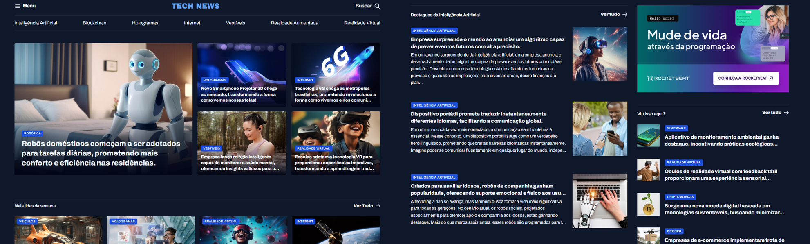

# 📰 Portal de Notícias

Projeto desenvolvido como parte da formação **Fullstack** da [Rocketseat](https://www.rocketseat.com.br/), utilizando **HTML5** e **CSS3**. O objetivo foi criar uma página de portal de notícias com foco em estruturação semântica e estilização moderna, promovendo uma boa experiência ao usuário.

## 📍 Acesse o Projeto

👉 [Clique aqui para ver o projeto online](https://fernandacanejo.github.io/curso-fullstack-rocketseat-portal-de-noticias/)

## ✨ Funcionalidades

- Página estática com layout responsivo
- Destaques de notícias
- Seção de categorias
- Rodapé com informações adicionais

## 🛠️ Tecnologias Utilizadas

- HTML5
- CSS3 com Grid Layout
- Estilização com uso de classes utilitárias (margens, espaçamentos, alinhamentos, etc.)

## 💡 Aprendizados

Durante o desenvolvimento deste projeto, foram reforçados os seguintes conceitos:

- Estruturação semântica com HTML
- Organização da página com **CSS Grid**
- Aplicação de **classes utilitárias** para facilitar a composição visual
- Uso de **CSS aninhado** para melhor organização dos estilos

  ## 📸 Prévia




## 🚀 Como Visualizar Localmente

1. Clone o repositório:  
    ```bash
    git clone https://github.com/fernandacanejo/curso-fullstack-rocketseat-portal-de-noticias.git
    ```

2. Acesse a pasta do projeto:  
    ```bash
    cd curso-fullstack-rocketseat-portal-de-noticias
    ```

3. Abra o arquivo `index.html` no seu navegador (basta dar um duplo clique ou usar o navegador de sua preferência).


Feito com 💜 por Fernanda Canêjo

